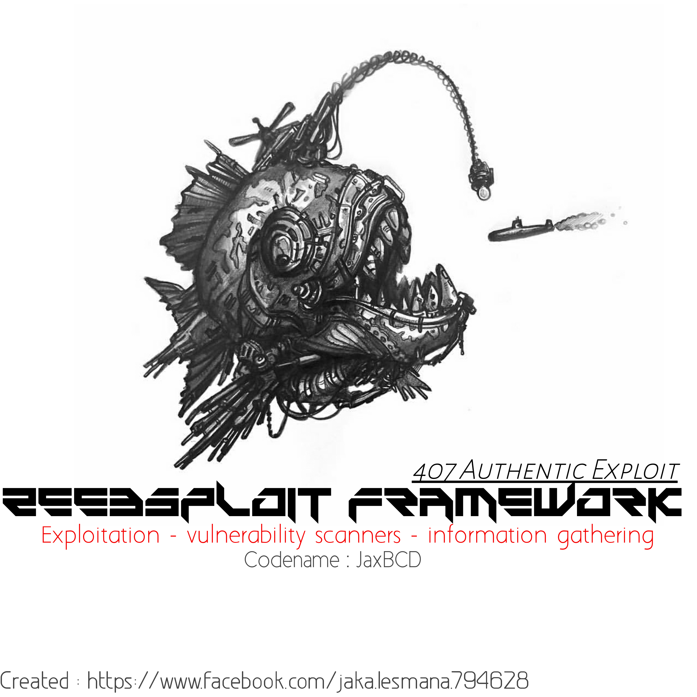

<br>zeebsploit is a tool for hacking</br>
<br>searching for web information and</br>
<br>scanning vulnerabilities of a web</br>

#### Installation & Usage
```
apt-get install git
git clone https://github.com/jaxBCD/Zeebsploit.git
cd Zeebsploit
chmod +x install
./install
python3 zeebsploit.py
type 'help' for show modules
and follow instruction
```
##### Modules
```
[Main modules]
+----------+-------------------------------+
| Modules  |          Description          |
+----------+-------------------------------+
| Exploit  |      Exploitation Modules     |
| Scanners |        Scanners Modules       |
|  infoga  | information Gathering Modules |
+----------+-------------------------------+

[Exploit Modules]
+---------------------------+--------------------------------------------------+
|          Modules          |                   Description                    |
+---------------------------+--------------------------------------------------+
|    wp content injection   | wordpress content injection version 4.7 or 4.7.1 |
|        wp revslider       |  wordpress plugin revslider remote file upload   |
|        wp learndash       |      wordpress leardash remote file upload       |
|         wp swhobiz        |   wordpress plugin showbiz remote file upload    |
|     joomla com fabrik     |       joomla component fabrik file upload        |
| joomla manager get config |     joomla component manager auto get config     |
|      joomla jdownload     |  joomla component jdownloads remote file upload  |
|          joomla           |  Joomla ads manager component auto shell upload  |
|     apache struts rce     |      CVE: 2017-5638 - Apache Struts2 S2-045      |
|                           |             remote command execution             |
|        drupal8 rce        |    drupal version 8 remote command execution     |
|  dvr cam leak credential  |              TBK DVR4104 / DVR4216               |
|                           |    - Credentials Leak (Get User and password     |
|     webdav file upload    |                     Nothing                      |
|         ---More---        |        Coming Soon the following version         |
+---------------------------+--------------------------------------------------+

[Scanner Module]
+--------------------+----------------------------------------+
|      Modules       |              Description               |
+--------------------+----------------------------------------+
| subdomain scanner  |         Scan Subdomain for Web         |
|    sqli scanner    |    Scan Sql Injection Vulnerability    |
|    xss scanner     |    Scan XSS Injection Vulnerability    |
|    lfi scanner     | Local File Includes Scanner etc/passwd |
| admin login finder |         Scan Admin Login page          |
| directory scanner  |   scan directory on web use dirhunt    |
| subdomain takeover |      scan type subdomain takeover      |
|     ---More---     |   Coming Soon the following version    |
+--------------------+----------------------------------------+

[Information Gathering]

+--------------------+------------------------------------------+
|      Modules       |               Description                |
+--------------------+------------------------------------------+
|    cms detector    |    a tool for detecting cms on a web     |
|    port scanner    |         Scan Open Port use Nmap          |
| information header |       response header information        |
|   ip geolocation   |   detect the location of an ip or host   |
|   email searcher   |         searching email from web         |
|     traceroute     | to show the route the package has passed |
| robot.txt detector |         Scan Robot.txt from Web          |
| header information |         Response Header Checker          |
|    whois lookup    |     looking for registered users or      |
|                    |  recipients of Internet resource rights  |
|     ---More---     |    Coming Soon the following version     |
+--------------------+------------------------------------------+
```
##### Join My Team : <a href="https://www.facebook.com/groups/1217219985083200">[Click This]</a>
##### Contact Me   : <a href="https://www.facebook.com/jaka.lesmana.794628">[Contact Me]</a>
